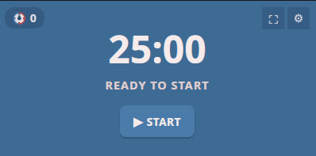
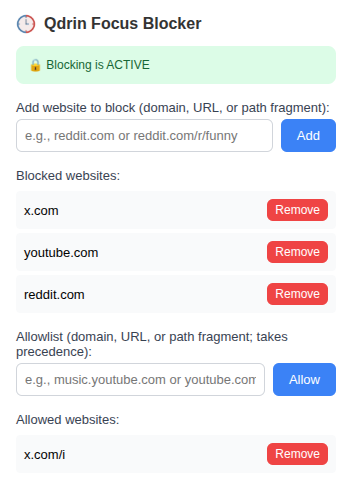

# Qdrin

A focus timer application with website blocking capabilities to help you stay productive during work sessions.

## Overview

Qdrin consists of two components:

- **Desktop App** - A Tauri-based desktop application with Angular frontend featuring a customizable focus/break timer
- **Browser Extension** - Chrome extension that blocks distracting websites during focus sessions




## Usage

1. **Start the Desktop App** - Launch Qdrin and configure your focus/break durations
2. **Install the Browser Extension** - Load the extension in Chrome
3. **Configure Blocked Sites** - Click the extension icon and add websites to block (e.g., `reddit.com`, `twitter.com`)
4. **Start a Focus Session** - Begin a timer session in the desktop app
5. **Stay Focused** - The extension will automatically block configured websites during focus mode

## How It Works

The desktop app runs a local HTTP server on `http://127.0.0.1:42069/status` that the browser extension polls every 2 seconds. When the app enters focus mode, the extension automatically enables website blocking using Chrome's declarativeNetRequest API.

## Project Structure

```
qdrin/
├── app/                    # Tauri + Angular desktop application
│   ├── src/               # Angular source files
│   └── src-tauri/         # Rust backend
├── browser/               # Chrome extension
│   ├── manifest.json      # Extension manifest
│   ├── background.js      # Service worker
│   └── popup.js           # Extension popup UI
└── README.md
```

## License

MIT

## Development

For detailed development information, see:
- [App README](app/README.md)
- [Browser Extension README](browser/README.md)
